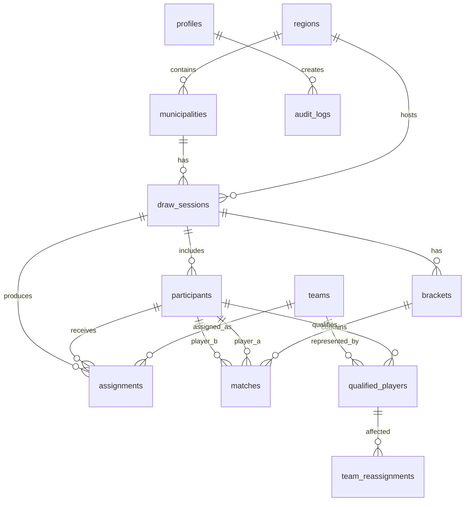

# 05 — Modelo de Datos

## Proyecto

Mundial FC 26 — Plataforma de Sorteo y Seguimiento

## Propósito

Definir el modelo de datos base para operar el torneo desde eliminatorias municipales hasta final estatal.

Este documento describe entidades, relaciones, estados, restricciones y tablas mínimas para implementar el MVP usando Supabase PostgreSQL.

## Alcance

Este modelo cubre:

- Catálogo de regiones.
- Catálogo de municipios participantes.
- Catálogo de selecciones del sorteo.
- Usuarios operadores.
- Sesiones de torneo por fase.
- Participantes.
- Asignación de selecciones mediante ruleta.
- Brackets de eliminación directa.
- Partidos y marcadores finales.
- Clasificados por fase.
- Reasignaciones por duplicidad de selección.
- Auditoría mínima.

Este modelo no cubre:

- Estadísticas minuto a minuto.
- Streaming.
- Evidencia multimedia.
- Gestión avanzada de permisos.
- Historial multi-año del torneo.
- Integración con sistemas externos.

---

# 1. Principios del modelo

## 1.1 Base de datos

La base de datos recomendada para el MVP es PostgreSQL mediante Supabase.

## 1.2 Identificadores

Todas las entidades principales deben usar UUID como identificador primario.

## 1.3 Fechas

Todas las fechas operativas deben guardarse en `timestamptz`.

## 1.4 Eliminación de datos

Para MVP no se requiere borrado lógico en todas las tablas.

Solo se recomienda `deleted_at` en entidades editables antes de cierre operativo:

- `participants`
- `draw_sessions`
- `matches`

## 1.5 Auditoría

Toda acción crítica debe registrarse en `audit_logs`.

Acciones críticas:

- Inicio de sorteo.
- Asignación de selección.
- Generación de bracket.
- Captura de marcador.
- Corrección de marcador.
- Reasignación de selección.
- Cierre de fase.
- Reapertura de fase.

---

# 2. Entidades principales

## 2.1 `regions`

Representa una región operativa del torneo.

Ejemplos:

- Huasteca Sur.
- Huasteca Centro.
- Huasteca Norte.
- Zona Media.
- Altiplano Norte.
- Altiplano Sur.
- Centro.

## 2.2 `municipalities`

Representa los municipios participantes.

Cada municipio pertenece a una región.

## 2.3 `teams`

Representa las 32 selecciones disponibles para sorteo.

El catálogo debe ser cerrado durante la operación del torneo.

## 2.4 `profiles`

Representa usuarios operadores del sistema.

Supabase Auth manejará autenticación. Esta tabla solo guarda el perfil operativo.

## 2.5 `draw_sessions`

Representa una sesión de competencia.

Puede ser:

- Municipal.
- Regional.
- Estatal.

## 2.6 `participants`

Representa jugadores registrados en una sesión.

En fase municipal se capturan manualmente.

En fase regional o estatal pueden generarse desde clasificados de fase anterior.

## 2.7 `assignments`

Representa la selección asignada a un participante.

La asignación puede venir de:

- Sorteo municipal.
- Reasignación por duplicidad regional.
- Reasignación por duplicidad estatal.

## 2.8 `brackets`

Representa la estructura de eliminación directa de una sesión.

## 2.9 `matches`

Representa cada partido del bracket.

Guarda jugadores, selecciones, marcador final, penales si aplica y ganador.

## 2.10 `qualified_players`

Representa clasificados a una siguiente fase.

Ejemplos:

- Campeón municipal.
- Subcampeón municipal.
- Campeón regional.
- Subcampeón regional.

## 2.11 `team_reassignments`

Representa una reasignación de selección por duplicidad entre clasificados.

## 2.12 `audit_logs`

Registra acciones críticas y correcciones.

---

# 3. Diagrama entidad-relación



---

# 4. Estados y enums

## 4.1 `user_role`

```sql
create type user_role as enum (
  'municipal_operator',
  'regional_operator',
  'state_committee',
  'viewer'
);
```

## 4.2 `stage_type`

```sql
create type stage_type as enum (
  'municipal',
  'regional',
  'state_final'
);
```

## 4.3 `session_status`

```sql
create type session_status as enum (
  'draft',
  'ready_for_draw',
  'drawing',
  'draw_completed',
  'bracket_ready',
  'bracket_active',
  'completed',
  'locked'
);
```

## 4.4 `participant_status`

```sql
create type participant_status as enum (
  'registered',
  'assigned',
  'playing',
  'eliminated',
  'champion',
  'runner_up',
  'qualified'
);
```

## 4.5 `assignment_source`

```sql
create type assignment_source as enum (
  'municipal_draw',
  'regional_reassignment',
  'state_reassignment'
);
```

## 4.6 `match_status`

```sql
create type match_status as enum (
  'pending',
  'ready',
  'completed',
  'locked',
  'correction_required'
);
```

## 4.7 `round_type`

```sql
create type round_type as enum (
  'round_32',
  'round_16',
  'quarterfinal',
  'semifinal',
  'final'
);
```

## 4.8 `qualification_rank`

```sql
create type qualification_rank as enum (
  'champion',
  'runner_up'
);
```

## 4.9 `sync_status`

```sql
create type sync_status as enum (
  'synced',
  'pending_sync',
  'sync_error'
);
```

---

# 5. Tablas

## 5.1 `regions`

```sql
create table regions (
  id uuid primary key default gen_random_uuid(),
  name text not null unique,
  sort_order int not null default 0,
  created_at timestamptz not null default now()
);
```

## 5.2 `municipalities`

```sql
create table municipalities (
  id uuid primary key default gen_random_uuid(),
  region_id uuid not null references regions(id),
  name text not null,
  municipal_date date null,
  regional_date date null,
  is_active boolean not null default true,
  created_at timestamptz not null default now(),

  constraint municipalities_region_name_unique unique (region_id, name)
);
```

## 5.3 `teams`

```sql
create table teams (
  id uuid primary key default gen_random_uuid(),
  name text not null unique,
  flag_code text not null,
  flag_asset_url text null,
  sort_order int not null default 0,
  is_active boolean not null default true,
  created_at timestamptz not null default now(),

  constraint teams_flag_code_unique unique (flag_code)
);
```

## 5.4 `profiles`

```sql
create table profiles (
  id uuid primary key,
  full_name text not null,
  role user_role not null,
  municipality_id uuid null references municipalities(id),
  region_id uuid null references regions(id),
  is_active boolean not null default true,
  created_at timestamptz not null default now(),

  constraint profiles_scope_check check (
    (role = 'municipal_operator' and municipality_id is not null)
    or (role = 'regional_operator' and region_id is not null)
    or (role in ('state_committee', 'viewer'))
  )
);
```

> `profiles.id` debe mapear al `auth.users.id` de Supabase.

## 5.5 `draw_sessions`

```sql
create table draw_sessions (
  id uuid primary key default gen_random_uuid(),
  stage stage_type not null,
  status session_status not null default 'draft',

  municipality_id uuid null references municipalities(id),
  region_id uuid null references regions(id),

  name text not null,
  participant_min int not null default 8,
  participant_max int not null default 32,
  allow_duplicate_teams boolean not null default false,

  created_by uuid null references profiles(id),
  started_at timestamptz null,
  completed_at timestamptz null,
  locked_at timestamptz null,
  deleted_at timestamptz null,
  created_at timestamptz not null default now(),

  constraint draw_sessions_stage_scope_check check (
    (stage = 'municipal' and municipality_id is not null)
    or (stage = 'regional' and region_id is not null)
    or (stage = 'state_final')
  )
);
```

### Restricción recomendada

Solo debe existir una sesión municipal activa por municipio.

```sql
create unique index draw_sessions_one_active_municipal_session
on draw_sessions (municipality_id)
where stage = 'municipal'
  and deleted_at is null
  and status <> 'locked';
```

## 5.6 `participants`

```sql
create table participants (
  id uuid primary key default gen_random_uuid(),
  session_id uuid not null references draw_sessions(id) on delete cascade,
  source_qualified_player_id uuid null,

  display_name text not null,
  turn_order int null,
  status participant_status not null default 'registered',
  sync_status sync_status not null default 'synced',

  created_at timestamptz not null default now(),
  updated_at timestamptz not null default now(),
  deleted_at timestamptz null,

  constraint participants_name_not_empty check (length(trim(display_name)) > 0),
  constraint participants_unique_name_per_session unique (session_id, display_name),
  constraint participants_unique_turn_per_session unique (session_id, turn_order)
);
```

## 5.7 `assignments`

```sql
create table assignments (
  id uuid primary key default gen_random_uuid(),
  session_id uuid not null references draw_sessions(id) on delete cascade,
  participant_id uuid not null references participants(id) on delete cascade,
  team_id uuid not null references teams(id),

  source assignment_source not null,
  assigned_at timestamptz not null default now(),
  created_by uuid null references profiles(id),
  sync_status sync_status not null default 'synced',

  constraint assignments_unique_participant unique (session_id, participant_id),
  constraint assignments_unique_team_per_session unique (session_id, team_id)
);
```

> `assignments_unique_team_per_session` asegura que una selección no se repita dentro de una misma sesión.

## 5.8 `brackets`

```sql
create table brackets (
  id uuid primary key default gen_random_uuid(),
  session_id uuid not null references draw_sessions(id) on delete cascade,

  bracket_size int not null,
  participant_count int not null,
  bye_count int not null default 0,
  status text not null default 'draft',

  generated_by uuid null references profiles(id),
  generated_at timestamptz not null default now(),
  locked_at timestamptz null,

  constraint brackets_one_per_session unique (session_id),
  constraint brackets_size_check check (bracket_size in (8, 16, 32)),
  constraint brackets_participant_count_check check (participant_count between 8 and 32),
  constraint brackets_bye_count_check check (bye_count >= 0)
);
```

## 5.9 `matches`

```sql
create table matches (
  id uuid primary key default gen_random_uuid(),
  bracket_id uuid not null references brackets(id) on delete cascade,
  session_id uuid not null references draw_sessions(id) on delete cascade,

  round round_type not null,
  match_number int not null,
  next_match_id uuid null references matches(id),

  player_a_id uuid null references participants(id),
  player_b_id uuid null references participants(id),
  team_a_id uuid null references teams(id),
  team_b_id uuid null references teams(id),

  regular_score_a int null,
  regular_score_b int null,
  extra_time_played boolean not null default false,
  penalties_played boolean not null default false,
  penalties_score_a int null,
  penalties_score_b int null,

  winner_id uuid null references participants(id),
  loser_id uuid null references participants(id),
  status match_status not null default 'pending',

  completed_by uuid null references profiles(id),
  completed_at timestamptz null,
  locked_at timestamptz null,
  deleted_at timestamptz null,
  created_at timestamptz not null default now(),

  constraint matches_unique_number_per_round unique (bracket_id, round, match_number),
  constraint matches_scores_non_negative check (
    (regular_score_a is null or regular_score_a >= 0)
    and (regular_score_b is null or regular_score_b >= 0)
    and (penalties_score_a is null or penalties_score_a >= 0)
    and (penalties_score_b is null or penalties_score_b >= 0)
  ),
  constraint matches_winner_must_be_player check (
    winner_id is null
    or winner_id = player_a_id
    or winner_id = player_b_id
  ),
  constraint matches_loser_must_be_player check (
    loser_id is null
    or loser_id = player_a_id
    or loser_id = player_b_id
  )
);
```

### Regla de aplicación

La base no puede validar por sí sola toda la lógica de empate, tiempos extra y penales.

La aplicación debe asegurar:

- No cerrar partido sin ganador.
- No permitir penales empatados.
- No permitir ganador distinto a los jugadores del partido.
- No permitir cierre si falta jugador A o jugador B, salvo avance por bye.

## 5.10 `qualified_players`

```sql
create table qualified_players (
  id uuid primary key default gen_random_uuid(),

  source_session_id uuid not null references draw_sessions(id),
  target_stage stage_type not null,

  participant_id uuid not null references participants(id),
  municipality_id uuid null references municipalities(id),
  region_id uuid null references regions(id),
  team_id uuid not null references teams(id),

  rank qualification_rank not null,
  is_active boolean not null default true,
  created_at timestamptz not null default now(),

  constraint qualified_unique_per_source_rank unique (source_session_id, rank),
  constraint qualified_target_stage_check check (target_stage in ('regional', 'state_final'))
);
```

## 5.11 `team_reassignments`

```sql
create table team_reassignments (
  id uuid primary key default gen_random_uuid(),

  stage stage_type not null,
  session_id uuid null references draw_sessions(id),
  qualified_player_id uuid not null references qualified_players(id),

  previous_team_id uuid not null references teams(id),
  new_team_id uuid not null references teams(id),
  kept_by_qualified_player_id uuid null references qualified_players(id),

  reason text not null default 'duplicate_team',
  resolved_by uuid null references profiles(id),
  resolved_at timestamptz not null default now(),

  constraint team_reassignments_team_change_check check (previous_team_id <> new_team_id)
);
```

## 5.12 `audit_logs`

```sql
create table audit_logs (
  id uuid primary key default gen_random_uuid(),

  actor_id uuid null references profiles(id),
  action text not null,
  entity_type text not null,
  entity_id uuid null,

  previous_value jsonb null,
  new_value jsonb null,
  reason text null,

  created_at timestamptz not null default now()
);
```

---

# 6. Constraints operativos

## 6.1 Participantes por sesión municipal

La aplicación debe validar:

- Mínimo 8 participantes.
- Máximo 32 participantes.

La base puede reforzarlo con función o trigger, pero para MVP puede validarse en aplicación.

## 6.2 Selección única por sesión

La restricción está en base:

```sql
constraint assignments_unique_team_per_session unique (session_id, team_id)
```

## 6.3 Participante con una sola selección

La restricción está en base:

```sql
constraint assignments_unique_participant unique (session_id, participant_id)
```

## 6.4 Un bracket por sesión

La restricción está en base:

```sql
constraint brackets_one_per_session unique (session_id)
```

## 6.5 Campeón y subcampeón por sesión

La tabla `qualified_players` permite un solo campeón y un solo subcampeón por sesión fuente:

```sql
constraint qualified_unique_per_source_rank unique (source_session_id, rank)
```

---

# 7. Catálogos iniciales

## 7.1 Regiones

Catálogo inicial recomendado:

| Región |
|---|
| Altiplano Norte |
| Altiplano Sur |
| Centro |
| Huasteca Centro |
| Huasteca Norte |
| Huasteca Sur |
| Zona Media |

## 7.2 Municipios participantes

Catálogo inicial operativo:

| Municipio | Región |
|---|---|
| Charcas | Altiplano Norte |
| Venado | Altiplano Norte |
| Cedral | Altiplano Norte |
| Catorce | Altiplano Norte |
| Matehuala | Altiplano Norte |
| Vanegas | Altiplano Norte |
| Villa de la Paz | Altiplano Norte |
| Salinas | Altiplano Sur |
| Tamazunchale | Huasteca Sur |
| Xilitla | Huasteca Sur |
| Axtla | Huasteca Sur |
| Tampamolón | Huasteca Centro |
| Aquismón | Huasteca Centro |
| Tancanhuitz | Huasteca Centro |
| Tamuín | Huasteca Norte |
| Ciudad Valles | Huasteca Norte |
| Ébano | Huasteca Norte |
| Rayón | Zona Media |
| Rioverde | Zona Media |
| Ciudad del Maíz | Zona Media |
| Cerritos | Zona Media |
| Ciudad Fernández | Zona Media |
| Villa de Pozos | Centro |
| Villa de Zaragoza | Centro |
| San Luis Potosí Capital | Centro |

## 7.3 Pendiente de validación

Antes de sembrar datos definitivos, se debe confirmar si la región de algunos municipios del Altiplano debe seguir exactamente la convocatoria o la imagen operativa más reciente.

---

# 8. Flujo de datos por fase

## 8.1 Municipal

```text
municipalities
  → draw_sessions(stage='municipal')
  → participants
  → assignments
  → brackets
  → matches
  → qualified_players(target_stage='regional')
```

## 8.2 Regional

```text
qualified_players(target_stage='regional')
  → resolver duplicidad de selecciones
  → team_reassignments, si aplica
  → draw_sessions(stage='regional')
  → participants generados desde clasificados
  → brackets
  → matches
  → qualified_players(target_stage='state_final')
```

## 8.3 Estatal

```text
qualified_players(target_stage='state_final')
  → resolver duplicidad de selecciones, si aplica
  → draw_sessions(stage='state_final')
  → participants generados desde clasificados regionales
  → brackets
  → matches
  → campeón estatal
```

---

# 9. Reglas para generación de bracket

## 9.1 Tamaño de bracket

| Participantes | Tamaño bracket | Byes |
|---:|---:|---:|
| 8 | 8 | 0 |
| 9–16 | 16 | `16 - participantes` |
| 17–32 | 32 | `32 - participantes` |

## 9.2 Rondas

| Tamaño bracket | Rondas |
|---:|---|
| 8 | Cuartos, semifinal, final |
| 16 | Octavos, cuartos, semifinal, final |
| 32 | Ronda 32, octavos, cuartos, semifinal, final |

## 9.3 Avance por bye

Un jugador con bye debe avanzar automáticamente.

El avance debe registrarse en `matches` o mediante generación directa del siguiente partido.

Para MVP se recomienda registrar el match con:

- `player_a_id` asignado.
- `player_b_id` nulo.
- `winner_id` igual a `player_a_id`.
- `status = completed`.

---

# 10. Reglas de marcador

## 10.1 Partido normal

Si `regular_score_a` y `regular_score_b` son distintos, el ganador se define por mayor marcador.

## 10.2 Empate

Si `regular_score_a = regular_score_b`, la aplicación debe exigir definición.

## 10.3 Penales

Si `penalties_played = true`, entonces:

- `penalties_score_a` es obligatorio.
- `penalties_score_b` es obligatorio.
- Los penales no pueden empatar.

## 10.4 Cierre

Al cerrar partido:

- `winner_id` debe quedar definido.
- `loser_id` debe quedar definido.
- `status` pasa a `completed`.
- `completed_at` se llena.

---

# 11. Reglas de duplicidad de selección

## 11.1 Duplicidad municipal

No se permite duplicidad de selección dentro de una misma sesión municipal.

## 11.2 Duplicidad regional

Puede existir duplicidad entre clasificados de municipios distintos.

Debe resolverse antes de generar bracket regional.

## 11.3 Duplicidad estatal

Puede existir duplicidad entre clasificados regionales.

Debe resolverse antes de generar bracket estatal.

## 11.4 Persistencia

Cada cambio debe guardarse en:

- `team_reassignments`
- `audit_logs`
- actualización del `team_id` efectivo del clasificado o participante de fase siguiente

---

# 12. Índices recomendados

```sql
create index idx_municipalities_region_id on municipalities(region_id);
create index idx_draw_sessions_stage on draw_sessions(stage);
create index idx_draw_sessions_municipality_id on draw_sessions(municipality_id);
create index idx_draw_sessions_region_id on draw_sessions(region_id);
create index idx_participants_session_id on participants(session_id);
create index idx_assignments_session_id on assignments(session_id);
create index idx_assignments_team_id on assignments(team_id);
create index idx_matches_bracket_id on matches(bracket_id);
create index idx_matches_session_id on matches(session_id);
create index idx_qualified_players_region_id on qualified_players(region_id);
create index idx_qualified_players_team_id on qualified_players(team_id);
create index idx_audit_logs_entity on audit_logs(entity_type, entity_id);
```

---

# 13. Reglas de seguridad con RLS

## 13.1 Operador municipal

Puede leer:

- Su municipio.
- Su sesión municipal.
- Participantes, asignaciones, bracket y partidos de su municipio.

Puede escribir:

- Participantes de su municipio mientras esté en `draft`.
- Asignaciones durante sorteo.
- Marcadores de partidos municipales.

No puede:

- Modificar otros municipios.
- Modificar fases regionales.
- Modificar final estatal.

## 13.2 Operador regional

Puede leer:

- Municipios de su región.
- Clasificados municipales de su región.
- Fase regional de su región.

Puede escribir:

- Reasignaciones regionales.
- Marcadores regionales.

No puede:

- Modificar municipios fuera de su región.
- Cerrar torneo estatal.

## 13.3 Comité estatal

Puede leer y escribir en todas las entidades operativas.

## 13.4 Público

Puede leer vistas públicas.

No puede escribir.

---

# 14. Vistas recomendadas

## 14.1 `vw_municipal_dashboard`

Debe consolidar:

- Municipio.
- Región.
- Estado de sesión.
- Total de participantes.
- Total de asignaciones.
- Partidos completados.
- Campeón.
- Subcampeón.

## 14.2 `vw_regional_dashboard`

Debe consolidar:

- Región.
- Municipios totales.
- Municipios completados.
- Clasificados municipales.
- Duplicidades pendientes.
- Estado de bracket regional.

## 14.3 `vw_state_dashboard`

Debe consolidar:

- Municipios completados.
- Participantes registrados.
- Partidos jugados.
- Clasificados municipales.
- Regiones completadas.
- Finalistas estatales.
- Campeón estatal.

---

# 15. Criterios de aceptación del modelo

## CA-01

El sistema puede registrar municipios y regiones sin duplicados.

## CA-02

El sistema puede crear una sesión municipal por municipio.

## CA-03

El sistema impide asignar la misma selección dos veces dentro de una sesión.

## CA-04

El sistema impide que un participante tenga más de una selección dentro de una sesión.

## CA-05

El sistema puede generar bracket para 8, 16 y 32 espacios.

## CA-06

El sistema puede registrar marcadores finales y ganador de partido.

## CA-07

El sistema puede determinar campeón y subcampeón de una sesión.

## CA-08

El sistema puede detectar duplicidad de selecciones entre clasificados.

## CA-09

El sistema puede registrar reasignaciones de selección.

## CA-10

El sistema registra auditoría para correcciones y acciones críticas.

---

# 16. Pendientes técnicos

1. Confirmar catálogo definitivo de 32 selecciones.
2. Confirmar regiones definitivas de municipios donde exista diferencia entre convocatoria e imagen operativa.
3. Definir si el público verá datos mediante vistas públicas o rutas protegidas.
4. Definir si se implementará modo offline parcial desde MVP.
5. Definir si los operadores usarán email/password, magic link o PIN temporal.
6. Definir si la final estatal reutiliza las selecciones de fase regional o permite nueva reasignación total.
